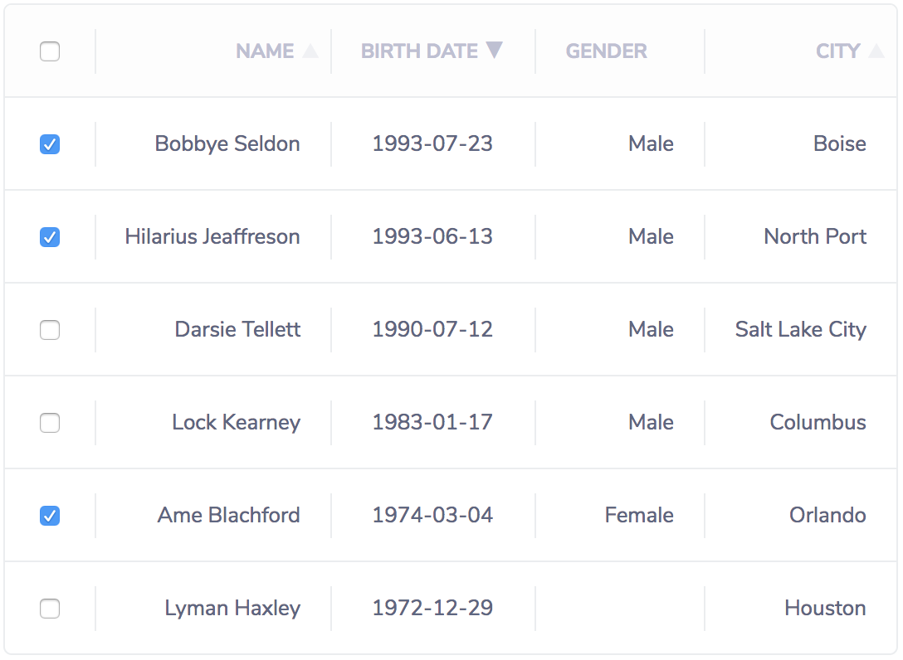

# Vue Data Tablee

![[JavaScript Style Guide][2]][3]
[](https://app.fossa.io/projects/git%2Bgithub.com%2FVitorLuizC%2Fvue-data-tablee?ref=badge_shield)

Yeap, another Vue table component. This one is based on [vue-good-table][0], a
simple and pretty table component.



## Install

Install from npm.

```sh
npm install vue-data-tablee
```

With `Vue.use` function declare vue-data-tablee components.

```js
import 'vue-data-tablee/dist/vue-data-tablee.css'
import Vue from 'vue'
import DataTablee from 'vue-data-tablee'

Vue.use(DataTablee)
```

You can also import just components you need, without installing globally.

```vue
<template>
  <data-table :rows="rows" :cols="cols" />
</template>

<script>
import { DataTable } from 'vue-data-tablee'

export default {
  components: { DataTable },
  ...
}
</script>
```

## Component Props

Name         | Type                                     | Default  | About
----         | ----                                     | -------  | -----
cols         | `Array.<Col>`                            | `[]`     | [Cols][4] list.
rows         | `Array.<Object>`                         | `[]`     | Rows list.
align        | `'center' \| 'right' \| 'left'`          | `'left'` | Global column alignment option.
empty        | `String`                                 | `''`     | Empty cell's character.
selectable   | `Boolean`                                | `false`  | Add checkbox column to select a row. It emits event on change
sort         | `Boolean \| Function.(a:*, b:*):Number`  | `true`   | Global sort option. Could enable/disable sort or use a custom [sort function][5].
sortExternal | `Boolean`                                | `false`  | Only change sort and arrow. Useful to sort outsite component.
## Cols properties

Name         | Type                                     | About
----         | ----                                     | -----
label        | `String`                                 | Column label (`<th>{{ label }}</th>`).
field        | `String`                                 | Property name, or property path. Ex `'user.contact.phone'`.
align        | `'center' \| 'right' \| 'left'`          | Column alignment option. Stronger than global sort
width        | `Number`                                 | Column width.
hidden       | `Boolean`                                | Defines if column is hidden.
headerClass  | `String`                                 | Adds this class to column header cell.
contentClass | `String`                                 | Adds this class to columns content cells.
sort         | `Boolean \| Function.(a:*, b:*):Number`  | Could enable/disable column sort or use a custom [sort function][5]. Stronger than global sort

## Events

Name   | Payload                                                | About
-----  | -------                                                | -----
select | `Array.<Object>`                                       | Emitted on select row (`selectable` option).
sort   | `{ column:Col, sortment:('ascending'\|'descending') }` | Emitted on sort change.

## License

Released under [MIT license][1].

[0]: https://github.com/xaksis/vue-good-table
[1]: ./LICENSE.md
[2]: https://standardjs.com
[3]: https://img.shields.io/badge/code_style-standard-brightgreen.svg
[4]: /#cols-properties
[5]: https://developer.mozilla.org/en-US/docs/Web/JavaScript/Reference/Global_Objects/Array/sort#Description


[](https://app.fossa.io/projects/git%2Bgithub.com%2FVitorLuizC%2Fvue-data-tablee?ref=badge_large)
